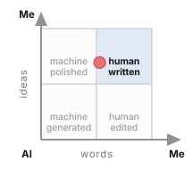
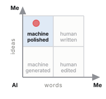
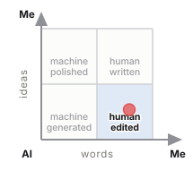
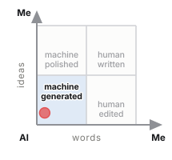

# Colophon

*Written over, never erased.*

## A method for recording, measuring and declaring human and AI contribution in writing

**Fabio Chinaglia** · August 2026  
*Methodological document, version 0.1*

> **The colophon** is the note that, since the fifteenth century, closes a book by declaring how it was produced: printer, typeface, paper, date. This method moves that function from the book to text written together with a language model. The payoff line, instead, comes from the palimpsest, the reused manuscript in which the earlier writing remains visible beneath the new one — and it is also the formal property of the register: append-only, no event overwritten, every revision added rather than replaced.

---

## Abstract

When a piece of content comes out of the joint work of a person and a language model, there is today no shared way of saying *how* it came about. Two options are available, both insufficient: binary self-declaration, which is not verifiable and says nothing useful, and statistical detection on the final text, which in the most frequent scenario — AI text edited by a human — falls to accuracy levels incompatible with any evidentiary use.

This document describes an alternative method, founded on three choices: **recording the process as it happens** rather than reconstructing it, **measuring on two independent axes** rather than one, and **separating the disclosure addressed to the reader from the inspectable record** that backs it. The method was developed and validated on a real case — a professional article of about 3,000 words written in session — and is distributed as a reusable skill.

The original contribution is of three kinds. On the measurement side, the separation between **lexical contribution** and **ideational contribution**, whose difference turns out to be the most useful information the method produces. On the taxonomy side, three categories of intervention that no existing scheme represents: **elicitation**, **deletion on suggestion** and **lexical carry-over from the conversation**. On the architecture side, the placement of the KPI not as a message to the reader but as an inspectable by-product of a signed record, which is the only structural answer available to the costless-signalling objection.

---

## 1. The problem

### 1.1 Why measuring on the final product does not work

The literature on the detection of AI-generated text converges on a replicated and stable result: **difficulty grows exactly where the real use case sits**.

Binary classification of a "pure" document reaches AUROC between 0.93 and 0.99 in the laboratory (Bao et al., *Fast-DetectGPT*, ICLR 2024, OpenReview Bpcgcr8E8Z; Hans et al., *Binoculars*, ICML 2024, arXiv:2401.12070). But on hand-edited AI text accuracy falls to around 39%, and on paraphrased text to 26% (Weber-Wulff et al., *Testing of detection tools for AI-generated text*, «International Journal for Educational Integrity», 2023, DOI 10.1007/s40979-023-00146-z). At word level, on genuinely co-written texts, metric-based methods stop at a mean F1 of 0.462 — worse than chance for a balanced task (*HACo-Det*, ACL 2025, arXiv:2506.02959). And the most recent multi-granularity benchmarks show that the difficulty curve is **bell-shaped, peaking around 50% AI coverage**: the realistic case is the worst case (*OpAI-Bench*, 2026, arXiv:2606.06481).

On top of this comes a documented and quantified distributive problem: detectors misclassify the text of non-native writers as AI with a false-positive rate that, in a study on TOEFL essays, reaches 61.22%, against 5.19% on native-speaker texts (Liang, Yuksekgonul, Mao, Wu & Zou, *GPT detectors are biased against non-native English writers*, «Patterns» (Cell Press), 2023, arXiv:2304.02819).

The conclusion to be drawn is not a design preference but a constraint: **if provenance is needed, it must be captured at the moment of production.**

### 1.2 Why self-declaration alone is not enough

The natural alternative — asking the author to declare — has a mirror-image problem. Across 5,114 academic journals and more than 164,000 full texts analysed, 70% of the titles have adopted a policy on AI use, but only about 0.1% of papers explicitly declare having used it, and no significant difference in adoption emerges between journals with and without a policy (He & Bu, *Academic journals' AI policies fail to curb the surge in AI-assisted academic writing*, 2026, arXiv:2512.06705).

The under-reporting is not only strategic: it is also cognitive. The phenomenon known as the *AI ghostwriter effect* shows that users do not perceive themselves as owners of the text produced by the AI, yet still avoid declaring its authorship (Draxler, Werner, Lehmann, Hoppe, Schmidt, Buschek & Welsch, *The AI Ghostwriter Effect*, ACM TOCHI, 2024; preprint arXiv:2303.03283). And the perception gap between those who write and those who read has been measured: writers are about 80% less likely than readers to consider a disclosure necessary (Fang, Wen & Lee, *What Influences Readers' and Writers' Perceived Necessity of AI Disclosure?*, 2026, N=727, arXiv:2604.27129).

Finally, the objection of principle: **a text cannot prove its own authorship.** Any voluntary disclosure is, strictly speaking, costless signalling. It is the most solid criticism that can be levelled at this kind of system (Pelc, *«Human authored»? Who knows*, «AI & SOCIETY», 2026, DOI 10.1007/s00146-026-03047-0), and it has to be faced, not sidestepped.

### 1.3 The gap

Crossing the two planes gives the space in which the method sits. Detection does not hold up at the granularity required; disclosure is not verifiable. Existing *process tracking* tools — which record typing, pasting and revisions — solve half the problem, but share three limits:

- **none of them records the prompt**, that is, the request that generated the output: they record only the text that enters the document;
- **none of them exposes an open interchange format**: every product generates a proprietary report, neither comparable nor verifiable by third parties;
- **none of them links the process log to a cryptographic signature**: reports are alterable, and existing cryptographic provenance systems (C2PA 2.4, April 2026) certify the origin, not the path.

In the world of code the first of these three problems has been addressed: *Agent Trace* (Cursor, RFC January 2026, CC BY 4.0) is a vendor-neutral JSON format for recording AI contributions alongside human ones, with contributor types `human | ai | mixed | unknown` and line-level granularity. For text there is nothing equivalent.

The method described here tries to occupy exactly that space.

---

## 2. Principles

**P1 — You record during, not after.** Retroactive application is allowed but produces a *reconstructed estimate*, which must be declared as such. The two must never be confused.

**P2 — Two axes, not one.** Who wrote the words and where the content comes from are distinct questions with distinct answers. Collapsing them produces a number that lends itself to being misread in both directions.

**P3 — The denominator is explicit.** Every percentage declares what it includes and what it excludes. Without this the number is not comparable across documents.

**P4 — The granularity is the span, not the token.** Attribution per single word is not more precise: it is more fragile, and it produces a visualisation that reads worse than the data it contains.

**P5 — The measurement is a by-product, not the message.** The KPI is not to be addressed to the reader: it is to be made inspectable by anyone who wants to verify.

**P6 — The limits are declared first.** The section on limits precedes the results, it does not follow them.

**P7 — No silent gaps.** If something is not tracked, the register must record that it was not tracked.

---

## 3. The register

### 3.1 Structure

The register is an append-only file in JSON Lines format. Each line is an event; each event contains the digest of the previous one:

```
h(0) = 0…0
h(n) = SHA256( h(n−1) ‖ canonical(evento_n) )
```

where `canonical` is a deterministic serialisation with sorted keys. Altering a past event invalidates all subsequent hashes, and verification recomputes the whole chain, flagging the first broken link.

The event types in use: `apertura_caso`, `brief`, `proposta_ai`, `contributo_umano`, `decisione_editoriale`, `vincolo`, `versione`, `sollecitazione`, `nota_di_registro`, `stato`. Events marked `meta` concern the design of the method and are excluded from the denominator of the measurement.

### 3.2 What the chain proves, and what it does not

**It proves** that an event has not been altered after being recorded and — with temporal anchoring — that it existed at a certain date.

**It does not prove that the register is complete.** No voluntary system can: one can record faithfully or omit, and cryptography does not distinguish the two cases. The register is moreover compiled by the language model about itself, which is the structural weak point of the method and must be declared, not hidden.

There is an interesting property that deserves experimental verification: **a chain anchored with continuity makes omission visible as a hole**, whereas a discrete per-document manifest does not. If the chain is continuous over time and a published piece of content has no corresponding events in the window in which it was written, the absence is itself a datum. It is not proof, but it is a signal no existing system produces. It is to be treated as a hypothesis, not as a result.

---

## 4. The measurement

### 4.1 The two axes

Every span receives two independent attributions:

| | question | values |
|---|---|---|
| **lex** | who wrote the words one reads in the final text? | U · A · UA |
| **idea** | where does the content those words express come from? | U · A · UA |

`UA` indicates the **inseparable mix**: not that two parties intervened, but that no traceable boundary exists. If the boundary exists, the span is split.

The AI share on each axis is

$$Q_{AI} = \frac{n_A + n_{UA}/2}{n_{tot}}$$

with the convention on the mix declared explicitly.

**Why two axes and not an ordinal scale.** The initial design provided for a six-level "role" scale (from *human only* to *AI only*), modelled on existing AI-use scales. In practice it proved unusable: too many real cases fall between two steps and the choice becomes arbitrary. Two ternary axes cover the same space, are assigned without hesitation in the majority of cases, and directly produce the two quantities of interest. **It is the most important simplification to have emerged from the validation.**

### 4.2 The phase axis

Every span also carries the phase in which its content was produced: `ricerca`, `struttura`, `prima_stesura`, `revisione_contenuto`, `revisione_forma`, `titolazione`. The distinction between content revision and copy revision follows the revision-intent taxonomy of *IteraTeR* (Du, Raheja, Kumar, Kim, Lopez & Kang, ACL 2022), built on 31,631 real revisions: the first changes what the text asserts, the second does not.

**The breakdown by phase is not a detail: it is what makes the aggregate number interpretable.** An overall 47% reads as "the machine wrote half of it"; knowing that the first draft is 86% human and that the AI operated in revision, research and outline tells a different and truer story.

### 4.3 The hard cases

The validation produced a body of cases that is the operationally densest part of the method.

**Absorption from brainstorming.** The author writes a draft in his own hand which he believes in good faith to be entirely human, but which contains formulations produced by the AI during ideation. In the validation case this amounts to about 214 words out of 2,288, 9.4% of the "human" draft. No detector would find them; no self-declaration would remember them.

**Carry-over from the conversation.** A formulation that appeared in an *editorial comment* by the AI — not in a proposed edit — reappears in the author's text. It is more insidious than the previous case because that sentence was never proposed as text: **a perfectly instrumented editor would not see it**. Only explicit vigilance catches it. An architectural requirement follows from this: whoever records a conversational collaboration must record the conversation, not only the artefacts exchanged.

**Elicitation.** The AI writes nothing and proposes nothing: it asks a question, and this causes new human content to be produced. The span is human in its words; the ideational origin is mixed, because the question determined the existence of the passage. No published scheme represents this case.

**Deletion on suggestion.** The AI proposes eliminating a passage and the author accepts. No AI word enters the text, but the final text is different because of an AI intervention: **invisible in any word count**. It is the mirror case of elicitation, and together they show that a word-based measure has to be flanked by an event-based measure.

**Multi-pass spans.** A span can go through four states — AI proposal, human rewrite, new AI proposal, acceptance — and the attribution records only the last. The history stays in the register; the KPI does not contain it.

**Diffuse lexical intervention.** A terminological normalisation touches fifteen spans, changing two or three words in each. Re-annotating them all as mixed would inflate the AI share misleadingly, because those paragraphs remain the author's in everything but a word; not touching them makes invisible an intervention that changed the load-bearing vocabulary of the text. The method records the event without altering the attribution and **declares the choice**. The threshold beyond which a diffuse intervention must also change the attribution remains an open problem.

### 4.4 The two checks

**Reconstruction.** The concatenation of the spans must reproduce the text exactly, excluding the declared blocks. It verifies that no passage is attributed to non-existent text and that no text is left without attribution.

**Coverage.** Every edit declared in the register must appear in at least one span, or be explainable as replaced by a later intervention or as diffuse.

The second check was added **after an incident during the validation**: an update to the annotation failed silently, the text came out correct, the reconstruction check passed, and for a few minutes the KPI reported a value wrong by almost a point. The first check alone does not detect drift between text and annotation. It is the kind of error the method has to prevent, because it is not manipulation: it is entropy.

---

## 5. The disclosure

### 5.1 The three-level architecture

| Level | Addressee | Content |
|---|---|---|
| **L1 — marker** | the reader skimming past | one line, no numbers, with a pointer to L2 |
| **L2 — note** | the reader who wants to understand | three parts: the icon, the note — the two percentages with their semantic unit, the explanation of the difference, the breakdown, the assumption of responsibility — and the technical line that points to L3 |
| **L3 — record** | whoever wants to verify | signed register, annotation, verification page |

The structure is not arbitrary. Three empirical results determine it.

Disclosing the use of AI **reduces trust**, with an effect mediated by perceived legitimacy and measured in professional contexts across thirteen experiments and 4,093 subjects (Schilke & Reimann, *The transparency dilemma: How AI disclosure erodes trust*, «Organizational Behavior and Human Decision Processes», 2025). But the drop occurs **only with detailed disclosures**: one-line ones keep trust at levels comparable to no disclosure at all (Prajod, Cools, Röggla, Puttur Venkatraj, Kusters, ElKattan, Cesar & El Ali, *Full Disclosure, Less Trust?*, ACM FAccT 2026, arXiv:2601.09620). And at the same time readers **want** the detail, and the most frequent question is not *how much* but *why* (Trusting News, research on AI disclosures, 2024).

The only architecture that loses nothing is therefore: a short marker where timeliness is needed, detail where context is needed. On placement, the only solid datum concerns visibility: labels at the foot or in a side column exceed 80% visibility, hover labels stop at 26% (Trusting News, *TrustKit*, 2024).

### 5.2 The KPI as proof, not as message

All competently designed disclosure systems have abandoned the quantitative, and the reason is correct: **a self-declared percentage is not verifiable, cannot be computed in good faith in the absence of instrumentation, and can be contested by anyone.**

The argument, however, presupposes that the percentage is *declared*. A percentage *measured* by an instrumented process is an epistemically different object, and the fact that nobody publishes one follows from the fact that nobody has the process trace: it is the gap, not a prohibition.

The condition for it to hold is that the KPI is not the message. In this architecture **the KPI and the visualisation are not the label: they are the proof that the label is not costless signalling.** It is the only structural answer available to the objection of principle in §1.2.

### 5.3 What not to declare

Absolute formulations — "100% human", "no AI" — are indefensible: there is no shared definition of AI-free text. Implicit comparisons with those who do not disclose activate the moral register, which is what makes the public turn *against* whoever discloses. Claims of regulatory compliance are almost always incorrect for professional content. And effort is not an argument the public weighs: the determinants it uses are substitutability, intentionality and directness of the contribution (Fang, Wen & Lee, 2026, arXiv:2604.27129).

---

## 6. The visualisation

HCI research on text highlighting is severe, and its strongest objections are well known: continuous palettes lose about sixteen points of reading accuracy compared with discrete ones — 47% against 63% (Correll, Moritz & Heer, *Value-Suppressing Uncertainty Palettes*, ACM CHI 2018, DOI 10.1145/3173574.3174216); at equal saturation, short words are perceived as less intense (Schuff, Jacovi, Adel, Goldberg & Vu, *Human Interpretation of Saliency-based Explanation Over Text*, ACM FAccT 2022, DOI 10.1145/3531146.3533127); the perceived intensity of a word depends on the neighbouring ones, asymmetrically (Jacovi, Schuff, Adel, Vu & Goldberg, *Neighboring Words Affect Human Interpretation of Saliency Explanations*, 2023, arXiv:2305.02679); and colour activates a deterministic mental model, so that a highlighted word is read as a fact and not as an estimate (Joslyn & Savelli, *Visualizing Uncertainty for Non-Expert End Users*, «Frontiers in Computer Science» 2, 2021, DOI 10.3389/fcomp.2020.590232).

**But these objections strike at the visualisation of *inferred* provenance.** With *observed* provenance the picture is reversed: reading the highlighting as a fact is correct, because it is a recorded fact; the bias against non-native writers disappears, because there is no stylistic inference; and a diverging axis becomes legitimate, because there is positive evidence of both poles. The direct precedent is per-author colouring on versioned corpora (Flöck & Acosta, *WikiWho*, WWW 2014, DOI 10.1145/2566486.2568026).

The constraints that do not depend on uncertainty remain valid, and the method respects them: visualisation unit at span level and not token level, redundant encoding across three channels (background, underline, accessible label), a palette numerically verified for separation under colour vision deficiency and for text contrast, switching between the two axes, and an explicit declaration of what the visualisation does **not** say.

### 6.1 The quadrant: the compact form

The heatmap answers *where*, the two percentages *how much*. Neither of them, however, is portable: you do not put a heatmap at the end of a post, and two percentages in a line of text read like one disclosure among others. A third object is needed, one that sits beside the published text and points to the record without replacing it.

The form is a quadrant. Two independent axes, each oriented from the AI towards the author: horizontally the human share of the **words**, vertically that of the **ideas**. The measured text is a point; the cell it falls into gives it a name.

| | author's ideas | AI's ideas |
|---|---|---|
| **author's words** | `human written` | `human edited` |
| **AI's words** | `machine polished` | `machine generated` |

The names are not new: three come from the classes of LLM-DetectAIve (Abassy et al., *LLM-DetectAIve: a Tool for Fine-Grained Machine-Generated Text Detection*, EMNLP 2024 System Demonstrations, arXiv:2408.04284), which distinguishes *human-written*, *machine-generated* and *machine-polished*. The fourth class of that work — *machine-written machine-humanized* — describes a text that the machine disguised on its own and has no place here: in its stead stands `human edited`, the case in which the author rewrites in his own words content that comes from the model. Reusing the nomenclature of detection is not an affectation: it makes an observed classification and an inferred one comparable, which is the premise for asking how wrong the second one is.

**The point stays visible above the lit cell, and it is not redundant.** The classification rounds at 50% on both axes, so a text just above the threshold receives the same label as one sitting in the corner. In the validation case the human share of the words is 52.9%: the icon says `human written` with less than three points of margin. The name alone would be a claim stronger than the data; the name plus the point are the data. This is why the tool that generates the icon warns when the margin is below five points, and in that case the category is not to be published without the point.

Two constraints of use. The icon is **generated from the measurement file**, never filled in by hand: it cannot diverge from the number it declares. And it has a real minimum size — below a hundred pixels a side the four labels stop being legible — so it is a document mark, not a favicon.

Four examples, one per cell. The first is the validation case of §9, with its real figures; the other three are typical situations, built to show how the note changes as the position in the quadrant changes.

| | |
|:--:|:--|
|  | **human written** — *Content: 69% mine, 31% the AI's. Text: 53% mine, 47% the AI's. The first draft is 86% mine; the AI worked mostly in revision, research and titling. I answer for every statement in it.* |
|  | **machine polished** — *Content: 88% mine, 12% the AI's. Text: 22% mine, 78% the AI's. The analysis, the data and the conclusions are mine and I dictated them; the drafting is the model's, reviewed line by line.* |
|  | **human edited** — *Content: 27% mine, 73% the AI's. Text: 79% mine, 21% the AI's. The angle and the outline come from the model; the words you are reading are almost all mine, and I checked every claim before making it my own.* |
|  | **machine generated** — *Content: 12% mine, 88% the AI's. Text: 8% mine, 92% the AI's. Text generated by the model to my specification and checked before publication. I answer for the facts it contains, not for the words they are written in.* |

The two middle rows are mirror images of each other, and they show why a single number would not do: both describe a half-and-half collaboration, but in one case the author brought the thinking and in the other the voice.

What the quadrant does **not** say: it is not a judgement of quality, it is not a threshold to clear, and `human written` does not mean "without AI". In the validation case that cell contains a text whose words are 47% the AI's.

---

## 7. The seal

Three *detached* artefacts, alongside the register, which stays intact and readable:

| file | answers | cost |
|---|---|---|
| `.sig` — Ed25519 signature | **who** | zero |
| `.tsr` — RFC 3161 timestamp | **when** | zero (free TSA) or ~€0.10–0.27 (qualified eIDAS) |
| `.ots` — OpenTimestamps anchoring | **when**, independently of any guarantor | zero |

Two design choices deserve a justification.

**The signature is performed by the author, not by the AI.** If the private key resides in the model's environment, the signature means nothing. The method produces the payload and hands over the command; the key stays where it has to stay.

**No format that encapsulates the file is used.** The Italian qualified signature typically produces a container that engulfs the document, making it no longer readable or comparable without a specific toolchain. For a register that lives by being inspectable this is the opposite of what is needed. Where full legal value is required, the route is to sign a *manifest* of digests periodically, leaving the logs intact.

---

## 8. Implementation

The method is distributed as a reusable skill, in two modes.

**Light** — register with chain, no per-span annotation, closing note with percentages declared as estimates. Almost no friction, suited to short content.

**Full** — the whole cycle: register, annotation, measurement on the two axes, verification page, three-level disclosure, seal.

Moving from light to full loses nothing, because the register is the same.

Components:

```
SKILL.md                   the cycle, the two modes, the mistakes not to make
reference/protocol.md      the attribution rules and the edge cases
reference/disclosures.md   the texts, with the empirical reasons
reference/VERIFY.md        the verification instructions to publish
scripts/record.py          append-only register with hash chain
scripts/measure.py         annotation → span → two axes, with the two checks
scripts/build_page.py      standalone verification page, light and dark
scripts/build_icon.py      the quadrant icon, generated from the measurement
scripts/build_note.py      the technical line of the note, from the register
scripts/seal.sh            signature, timestamp, anchoring
```

The annotation resides in a data file separate from the code, so the tool stays identical across cases and only the annotation changes. A case folder contains register, annotation, versions and the scripts that read them: **it verifies itself**, without depending on the current version of the skill.

---

## 9. Validation

### 9.1 The case

A professional article in Italian, about 3,000 words, intended for publication. Process declared by the author at the outset: brainstorming with the AI, entirely human drafting, joint revision. Two revision cycles, the first with fourteen tracked edits proposed by the AI and decided one by one, the second with more than thirty interventions by the author.

### 9.2 Results

| | |
|---|---|
| Final text | 3,126 words, 75 spans |
| Events in the chain | 75, reconstruction and coverage verified |
| **Lexical AI share** | **47.1%** |
| **Ideational AI share** | **30.6%** |
| First draft | ~86% human |
| Revision, research, titling | predominantly AI |

**The gap of about 16 points between the two axes is the most informative result**: the AI wrote more words than it brought ideas, because it intervened above all in revision and in documentary input. A single number would have said 47% and hidden that the first draft is almost entirely the author's.

### 9.3 What the validation changed in the method

- The six-level scale was **replaced** by the two ternary axes (§4.1).
- The coverage check was **added**, after an incident of silent drift (§4.4).
- The three categories in §4.3 that no existing scheme represents were **discovered**.
- The conversation was **identified** as a provenance channel, with the architectural consequence that follows.

### 9.4 Limits of the validation

**One case, one annotator, and the annotator is an interested party.** The attribution was compiled by the language model that co-wrote the text. It is the most serious limit and it cannot be mitigated by any means other than an inter-rater protocol.

**100% acceptance rate in the first cycle.** All fourteen proposed edits were accepted. From a single case it is not possible to distinguish whether the proposals were well calibrated or whether an effect of deference towards the reviewer was at work. The literature on *acceptance rate* in software warns that a high rate measures surface plausibility and the low friction of accepting, not value.

**Observation effect.** The author knew he was being observed. It is the "defensive writing" effect that constitutes the main criticism of all *process tracking* tools, and in a first case it cannot be got around.

**Single language, single genre.** Italian, professional article. Nothing has been verified on other languages or genres.

---

## 10. Future work

**Inter-rater validation.** It is the obligatory step. Two or three independent annotators on the same text, with a measure of agreement. The benchmark to beat or to declare: discrete provenance attribution on versioned corpora reaches agreement of 83–89% in the literature (Flöck & Acosta, WWW 2014, DOI 10.1145/2566486.2568026); graded judgement of the intensity of AI editing stops at around 0.66 Krippendorff's alpha (*EditLens*, 2025, arXiv:2510.03154). **The ideational axis is to be expected closer to the second value than to the first**, and the method must declare it.

**An event measure alongside the word measure.** Deletions, elicitations and multi-pass spans have no representation in the word count. A second indicator is needed, and it must be designed without duplicating the first.

**The threshold for diffuse intervention** (§4.3) remains open.

**Capture outside the conversation.** Today the method observes what passes through the conversation. An extension to work carried out in an editor requires integration with a telemetry source, with the trust problems that follow from it.

**Verification of the continuity property** (§3.2): whether a chain anchored with continuity does in fact make omission detectable.

**An interchange format.** The world of code adopted an open, vendor-neutral format for AI contributions in less than two years (*Agent Trace*, Cursor, 2026). Text has nothing equivalent, and the annotation format described here is a minimal candidate.

---

## 11. Note on the provenance of this document

Consistently with what it argues, this document declares its own.

It was produced by a language model at the author's request, starting from the research material, the event register and the artefacts of the validation case produced in the same session. The lexical AI share is close to total; the ideational share is mixed, because the method it describes was born of the joint work documented in the register — and in particular the three categories in §4.3 emerged from the observation of the author's interventions, not from a proposal by the model.

It has not been annotated span by span. The percentages in §9.2 refer to the **article** that was the object of validation, not to this document.

This English version is a translation of the Italian original, produced by a language model and reviewed by the author. The translation is recorded in the register of the validation case. Where the two versions diverge, the Italian text prevails: it is the one the measurement was taken on.

---

## References

The complete references, with URLs and verification notes, are in the survey documents that accompany this work:

| | |
|---|---|
| `00_sintesi_stato_arte.md` | synthesis and gap analysis |
| `01_letteratura_coscrittura.md` | human-AI co-writing taxonomies |
| `02_strumenti_provenance.md` | process capture tools |
| `03_detection_watermarking.md` | fine-grained detection and watermarking |
| `04_metriche_e_policy.md` | contribution metrics, policy, validity of the measurement |
| `05_visualizzazione.md` | prior art and HCI research on highlighting |
| `06_disclosure_editoria_piattaforme.md` | platform policies and professional ethics |
| `07_marchi_e_obblighi_professionali.md` | marks, regulation, public perception |
| `08_cattura_workflow_professionale.md` | technical capture in the professional workflow |
| `09_addendum_caso_professionale.md` | the case of the author who discloses voluntarily |
| `10_opzioni_di_progetto.md` | decision analysis on taxonomy and architecture |
| `11_firma_e_marca_temporale.md` | signature, timestamp, costs and verification |

Every quantitative claim in this document is anchored to a primary source indicated in those files. Where a source has not been directly verifiable, it is flagged as such.

---

*MIT License — Copyright (c) 2026 Fabio Chinaglia.*
